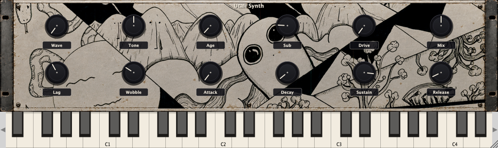

<div align="center">

# 🎛️ UTALI SYNTH

**A warm, polyphonic vintage analog synthesizer with PolyBLEP anti-aliased oscillators, ADAA tape saturation, stereo BBD chorus, and a hand-crafted 3x Retina illustrated chassis.**

[](https://github.com/DJMAccie/Utali-Synth/releases)
[](https://github.com/DJMAccie/Utali-Synth/actions)
[](LICENSE)
[](https://github.com/DJMAccie/Utali-Synth/releases)
[](https://github.com/DJMAccie/Utali-Synth/releases)
[](https://juce.com)

<br />



</div>

---

## 🌟 Overview

**Utali Synth** is a polyphonic virtual analog synthesizer engineered for deep, characterful vintage tones. Built on modern real-time DSP principles with JUCE 8 and C++20, it blends authentic analog imperfections—tape saturation, organic pitch drift, and BBD chorus modulation—with pure vector UI aesthetics.

---

## ✨ Features

### 🔊 Audio Engine & DSP
- **8-Voice Polyphony & Unison**: Polyphonic voice allocator with up to 4-voice unison detune per voice plus an independent sub-oscillator.
- **PolyBLEP Anti-Aliased Oscillators**: Bandlimited Sine, Square, Triangle, and Sawtooth waveforms with PolyBLEP residual smoothing to eliminate harsh digital foldover aliasing.
- **Analog Age & Drift**: Organic per-voice pitch drift modeling temperature instability and aging analog component tolerances.
- **Ladder LPF12 Filter**: 12 dB/oct ladder lowpass filter processed in sub-blocks with sample-accurate smoothed cutoff and resonance tracking.
- **ADAA Tape & Tube Saturation**: Antiderivative Anti-Aliasing (ADAA) tanh-style drive stage with synchronous sample interpolation and a 10 Hz DC-blocking filter.
- **Stereo BBD-Style Chorus**: Dedicated stereo chorus with delay lag time, wobble modulation depth, and wet/dry mix controls.
- **Musical ADSR Envelope**: Precision envelope generator with a custom quadratic sustain sensitivity taper—ensuring delicate lower-end travel without volume jumps.
- **Zero-Click Voice Stealing**: 5 ms fast-fade restitution algorithm on stolen voices prevents sample-to-sample discontinuities and audible pops during fast polyphonic passages.

### ⚡ Real-Time Safety & Standards
- **Zero Dynamic Memory Allocation**: Scratch and wet/dry buffers pre-allocated in `prepareToPlay()`—zero calls to `malloc`, `new`, `std::vector::push_back`, or `setSize()` in the audio thread.
- **Lock-Free Parameter System**: All parameter updates stream through lock-free atomics (`std::atomic<float>*`). Zero mutex locks or blocking system calls in `processBlock()`.
- **Parameter Smoothing**: All continuous parameters (`Drive`, `Lag`, `Wobble`, `Mix`, `Cutoff`, `Resonance`, `Sub`, `Pan`) utilize `juce::SmoothedValue<float>` with 20 ms ramps to eliminate zipper noise.
- **Host Latency & Tail Reporting**: Accurately reports 0 latency samples and a 5.0-second tail length to your DAW host.

### 🎨 Visual Aesthetics & LookAndFeel
- **Ultra-High Resolution 3x Retina Artwork**: Master illustrated vintage faceplate rendered at `3072 x 693` with bicubic anti-aliasing (`Graphics::highResamplingQuality`).
- **Procedural Vector Hardware Knobs**: Custom vector rotary knobs featuring concentric chamfered bezels, drop shadows, dark anodized bodies, and warm cream (`#ece5d8`) pointer indicators.
- **Dark Pill Nameplates**: Elegant pill-shaped parameter tags with subtle borders for high legibility across the illustrated background.
- **Aspect-Ratio Locked Resizing**: Seamless window scaling with locked `1024:306` aspect ratio (supported from `512x153` up to `2048x612`).
- **Vintage Keyboard**: Integrated interactive ivory and ebony piano keys with velocity response.

---

## 🎛️ Control Surface

| Parameter | Type | Default | Description |
| :--- | :--- | :--- | :--- |
| **Wave** | Selector | Sine | Primary oscillator waveform: Sine, Square, Triangle, Sawtooth (PolyBLEP anti-aliased) |
| **Tone** | Continuous | 2000 Hz | Ladder lowpass filter cutoff frequency (20 Hz – 20,000 Hz) |
| **Age** | Continuous | 2% | Analog component drift, phase instability, and vintage pitch wander |
| **Sub** | Continuous | 20% | Dedicated sub-oscillator level tuned one octave below the root pitch |
| **Drive** | Continuous | 1.0x | ADAA non-linear tape saturation gain with DC-blocking highpass |
| **Mix** | Continuous | 50% | Wet/dry blend for the stereo bucket-brigade style chorus |
| **Lag** | Continuous | 15 ms | Chorus center delay line time (5 ms – 30 ms) |
| **Wobble** | Continuous | 30% | Chorus LFO pitch modulation depth |
| **Attack** | Continuous | 10 ms | ADSR attack envelope time (1 ms – 2.0 s) |
| **Decay** | Continuous | 100 ms | ADSR decay envelope time (0 ms – 2.0 s) |
| **Sustain** | Continuous | 70% | ADSR sustain level with musical quadratic taper |
| **Release** | Continuous | 500 ms | ADSR release envelope time (10 ms – 5.0 s) |

---

## 📥 Downloads & Installation

Pre-compiled Release builds are available on the [**Releases Page**](https://github.com/DJMAccie/Utali-Synth/releases):

### 🍎 macOS
- **Formats**: VST3, AU (AudioUnit), Standalone App
- **Architectures**: Universal (Apple Silicon arm64 & Intel x86_64)
- **Installation**:
  - **VST3**: Copy `UTALISYNTH.vst3` to `~/Library/Audio/Plug-Ins/VST3/` or your DAW's custom plugin folder (e.g. `~/Documents/Plugins/`).
  - **AudioUnit**: Copy `UTALISYNTH.component` to `~/Library/Audio/Plug-Ins/Components/`.
  - **Standalone**: Open `UTALISYNTH.app` directly.

### 🪟 Windows
- **Formats**: VST3, Standalone Executable
- **Architectures**: 64-bit (`x86_64`)
- **Installation**:
  - **VST3**: Extract `UTALISYNTH.vst3` to `C:\Program Files\Common Files\VST3\`.
  - **Standalone**: Run `UTALISYNTH.exe`.

---

## 🛠️ Building from Source

### Prerequisites
- **CMake**: version 3.22 or higher
- **C++ Compiler**: Supporting C++20 (Clang / AppleClang 15+, MSVC 2022 v17+, GCC 12+)
- **JUCE Framework**: Automatically downloaded via `FetchContent` (version 8.0.6) if not installed locally.

### Build Commands

```bash
# Clone the repository
git clone https://github.com/DJMAccie/Utali-Synth.git
cd Utali-Synth

# Configure CMake
cmake -B build -DCMAKE_BUILD_TYPE=Release

# Build all targets (VST3, AU, Standalone, and Tests)
cmake --build build --config Release --parallel

# Run automated verification test suite
./build/UtaliSynthTests_artefacts/Release/UtaliSynthTests
```

---

## 🧪 Automated Testing

Utali Synth includes an integrated console test suite (`UtaliSynthTests`) validating:
1. **Audio Rendering & Sanity**: RMS level verification, bound checking, and absence of NaNs / Infs.
2. **Voice Stealing Discontinuity**: Ensures sample-to-sample deltas remain under threshold during voice theft.
3. **Sample Rate & Block Size Matrix**: Tests 44.1 kHz, 48 kHz, 88.2 kHz, 96 kHz, and 192 kHz with block sizes from 32 to 2048 samples.
4. **Waveform & ADAA Saturation**: Full test of all 4 waveforms under maximum non-linear drive.
5. **Sustain Sensitivity Curve**: Quadratic taper validation for musical velocity response.
6. **Pixel-Perfect UI Snapshot**: Renders and validates the complete visual component tree.

---

## 📄 License

This project is licensed under the [GNU General Public License v3.0](LICENSE) (matching JUCE framework terms).

---

<div align="center">
  <sub>Crafted with precision by <b>UTALI</b></sub>
</div>
